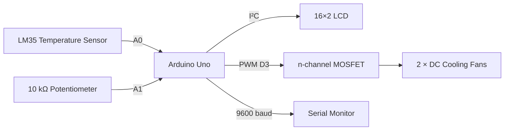
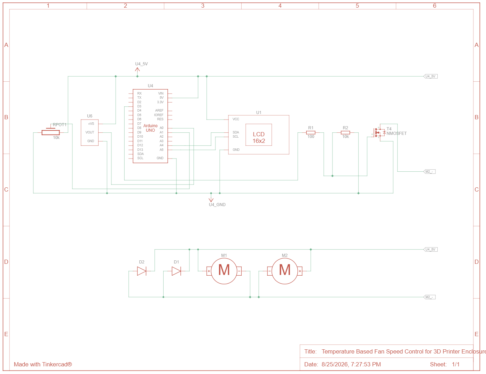

# Arduino-Controlled 3D Printer Enclosure

Temperature-regulation system built around an Arduino Uno, **LM35 temperature sensing**, an adjustable temperature setpoint, **MOSFET-driven PWM fan control**, and a **16×2 I²C LCD**.

> **Project type:** Multidisciplinary engineering group project  
> **Role:** Electrical Lead  
> **Primary tools:** Arduino Uno, LM35, PWM, MOSFET switching, I²C, Tinkercad

## Overview

This project implemented an electronic cooling controller for a 3D printer enclosure. The controller measures enclosure temperature using an **LM35**, lets the user select a desired threshold with a **10 kΩ potentiometer**, and controls two cooling fans through an **n-channel MOSFET** using an Arduino PWM output.

The system also provides live operating information on a **16×2 I²C LCD** and outputs diagnostic values to the Arduino serial monitor.

My contribution as **Electrical Lead** focused on the electrical-control subsystem: integrating the sensing and fan-control hardware, implementing the Arduino control logic, testing system behaviour, and documenting the circuit and firmware.

## System Architecture



## How It Works

1. The Arduino averages **20 LM35 ADC samples** to reduce short-term measurement noise.
2. The LM35 voltage is converted to temperature in °C using its 10 mV/°C relationship.
3. The potentiometer is averaged over **20 samples** and mapped to a **25–40 °C** user-selectable threshold.
4. When measured temperature is at or below the threshold, the fans remain off.
5. Above the threshold, the target PWM command increases with temperature and is constrained to **80–255**.
6. A smoothing term makes the PWM command transition gradually toward the target instead of changing abruptly.
7. The LCD displays measured temperature, selected threshold, and commanded fan percentage.
8. The serial monitor outputs the same values for diagnostics during testing.

The controller is a **threshold-based variable-speed controller**. It is not PID control and does not measure actual fan RPM.

## Electrical Design

The physical prototype used:

- Arduino Uno R3
- LM35 temperature sensor
- 10 kΩ potentiometer
- 16×2 I²C LCD
- 2 × DC cooling fans
- n-channel MOSFET
- 100 Ω resistor
- 10 kΩ resistor
- 2 × diodes
- breadboard and prototype wiring

The MOSFET provides the switching interface between the Arduino PWM signal and the fan load rather than driving the motors directly from an Arduino output pin.

See the full [Bill of Materials](hardware/BOM.md).

## Schematic



> **LM35/TMP36 note:** The physical prototype used an **LM35**. Tinkercad did not provide an LM35 component, so a **TMP36 symbol is used only as a visual stand-in** in the retained schematic. The firmware uses the LM35 conversion relationship.

## Firmware

The complete source is available at [`firmware/fan_controller.ino`](firmware/fan_controller.ino).

Key implementation details:

| Function | Implementation |
|---|---|
| Temperature input | LM35 on A0 |
| User setpoint | 10 kΩ potentiometer on A1 |
| Fan command | PWM on D3 |
| Display | 16×2 I²C LCD at `0x27` |
| ADC averaging | 20 samples per analog input |
| Setpoint range | 25–40 °C |
| Active PWM range | 80–255 |
| PWM smoothing | 0.1 update factor |
| Diagnostics | Serial at 9600 baud |

See [Control Logic](docs/control_logic.md) for a detailed explanation.

## Testing and Evidence

The physical circuit was operated with the firmware while sensor values and thermal response were monitored to support troubleshooting and verify integrated fan-control behaviour.

Retained evidence currently includes:

- Arduino firmware;
- Tinkercad electrical schematic;
- component list / BOM;
- a working-system video from the physical prototype.

The video will be added under [`media/`](media/) when available in the repository.

No quantitative calibration, fan-RPM, thermal-response, or repeatability dataset was retained, so this project does **not** claim numerical temperature accuracy or closed-loop performance.

See [Testing and Limitations](docs/testing_and_limitations.md).

## Design Decisions

A few decisions that shaped the electrical-control system:

- **MOSFET fan switching:** used to interface the Arduino PWM signal with the fan load rather than sourcing motor current directly from the microcontroller.
- **Adjustable threshold:** the potentiometer lets the user choose a desired temperature between 25 °C and 40 °C.
- **ADC averaging:** 20 samples are averaged for both analog inputs to reduce short-term fluctuation.
- **Minimum active PWM:** once cooling is requested, the target command is constrained to at least 80/255 rather than commanding very low PWM values.
- **Output smoothing:** the fan command approaches its target gradually to avoid abrupt changes in commanded speed.
- **LCD + serial output:** local display supports normal operation while serial output supports debugging and testing.

See [Design Decisions](docs/design_decisions.md) for additional detail.

## Repository Structure

```text
arduino-3d-printer-enclosure/
├── README.md
├── firmware/
│   └── fan_controller.ino
├── hardware/
│   ├── BOM.md
│   ├── tinkercad_schematic.png
│   └── tinkercad_component_list.png
├── docs/
│   ├── control_logic.md
│   ├── design_decisions.md
│   └── testing_and_limitations.md
└── media/
    └── README.md
```

## Current Limitations

- PWM percentage represents the **commanded output**, not measured fan RPM.
- The fans do not provide tachometer feedback.
- No retained LM35 calibration dataset is available.
- No retained quantitative temperature-response or repeatability dataset is available.
- The temperature conversion assumes an approximately 5 V Arduino ADC reference.
- The controller is threshold-based rather than PID or model-based.
- The Tinkercad schematic uses a TMP36 symbol as a stand-in for the physical LM35.

## Possible Future Improvements

Potential extensions include:

- calibrating the LM35 against a reference thermometer;
- logging temperature-versus-time during controlled tests;
- adding fan tachometer feedback;
- comparing the current controller against proportional or PID control;
- measuring fan current and validating component ratings;
- replacing the breadboard implementation with a PCB or permanent wiring harness.

## Academic Context

This repository documents the electrical-control subsystem of an academic multidisciplinary engineering project. It is presented to demonstrate my technical contribution, implementation process, and understanding of the system; it is not presented as an independently designed commercial 3D printer enclosure.
