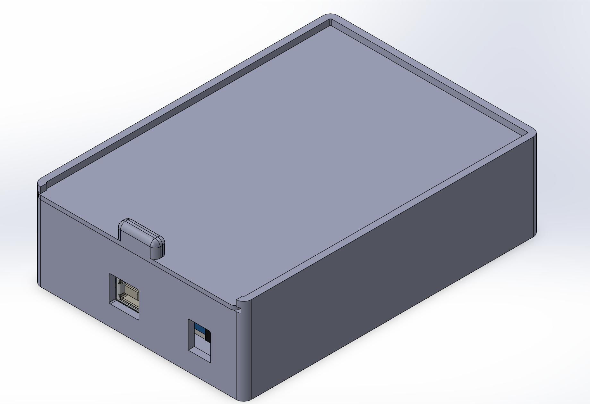
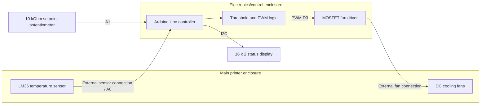
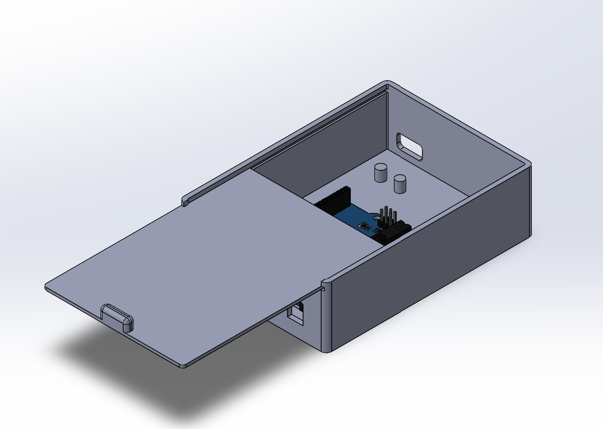
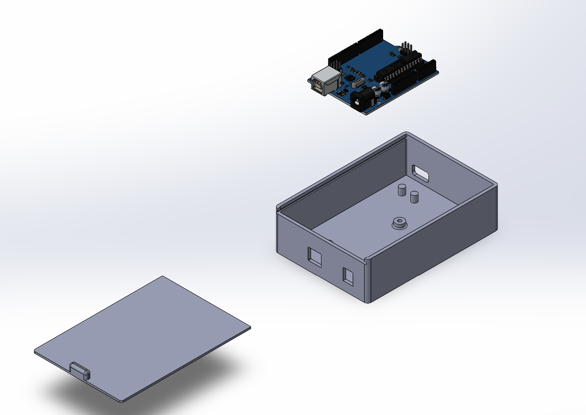
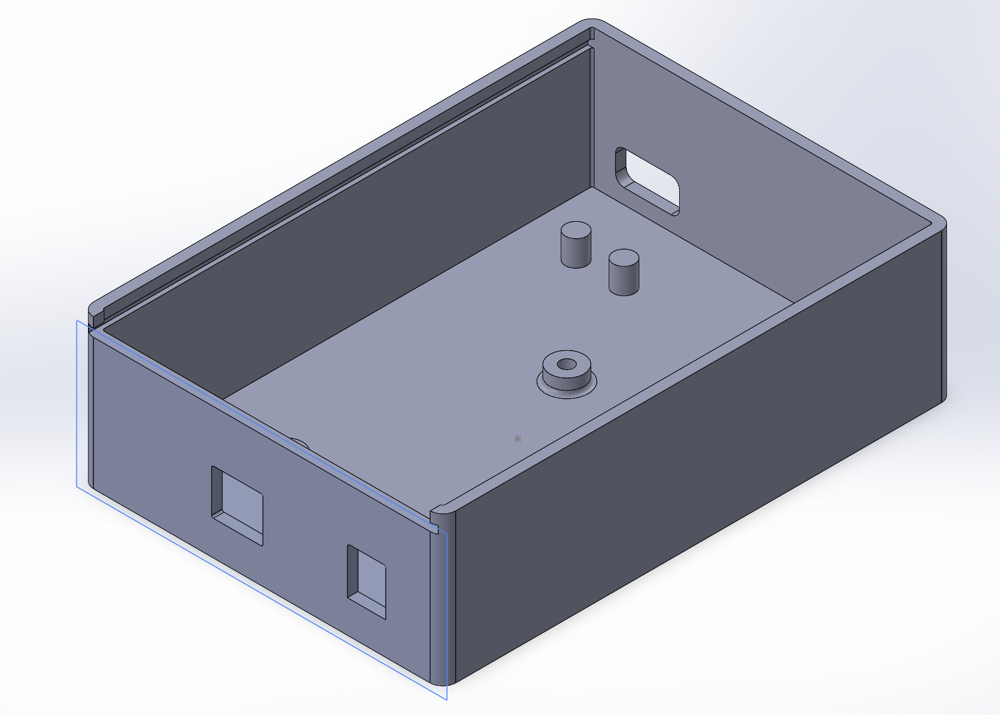
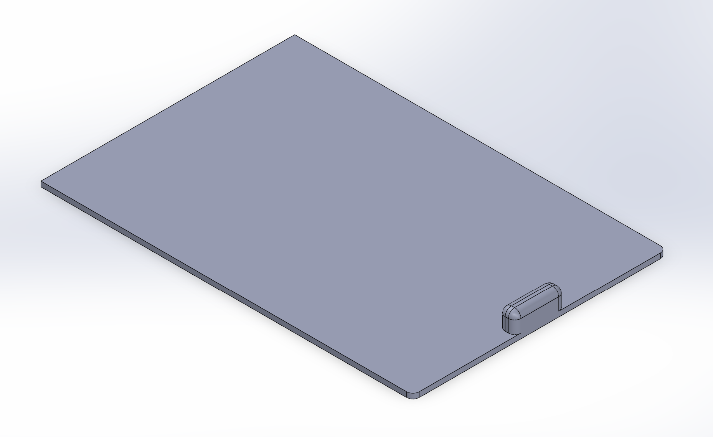
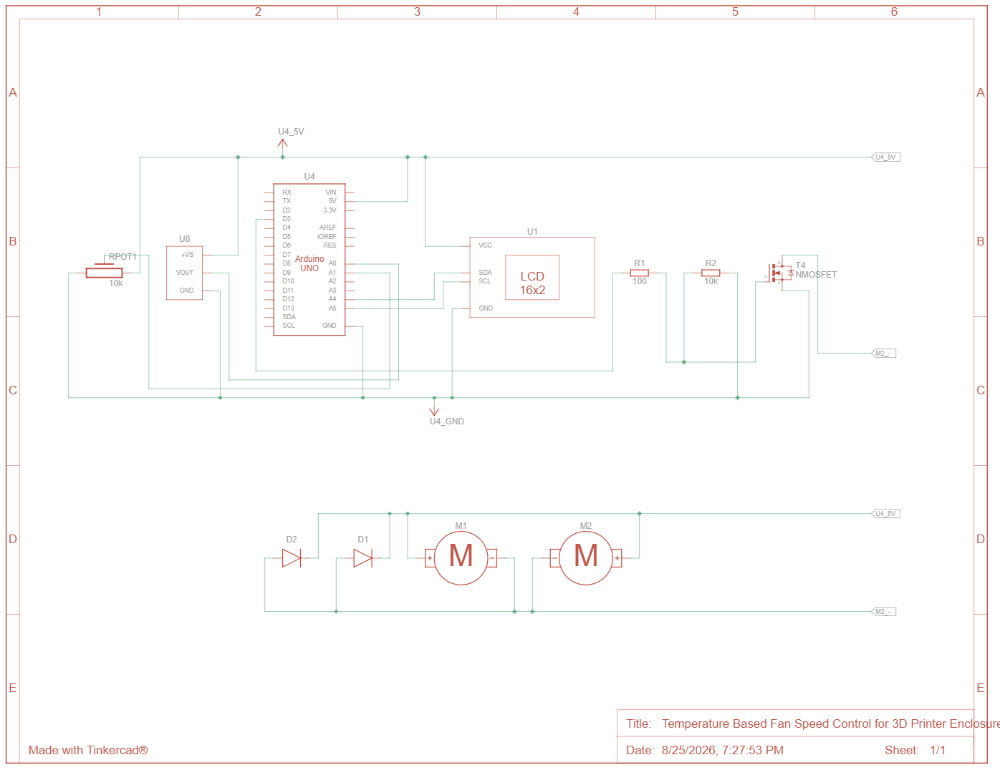

# Arduino-Controlled 3D Printer Enclosure

This portfolio project combines an Arduino-based temperature-control prototype with a later SolidWorks electronics-packaging extension. It documents analog temperature sensing, PWM fan actuation, prototype testing, electrical integration, parametric enclosure design, assembly modelling, and engineering drawings while keeping the original group work separate from the independent CAD work.



*Closed assembly showing the Arduino controller packaged within the electronics enclosure.*

## Project Overview

### Phase 1 - Thermal-Control Prototype

**Original group project | January-April 2025**

**My role: Electrical Lead**

The group project developed a temperature-regulation system for a 3D-printer enclosure. My work covered the Arduino control system, analog temperature-sensor integration, MOSFET-switched PWM fan control, live monitoring, electrical subsystem integration, system testing, troubleshooting, and wiring/system documentation.

The retained firmware and hardware documentation identify the sensor as an **LM35 analog temperature sensor**. It measures the main printer-enclosure temperature, and the cooling fans act on that main enclosure.

### Phase 2 - Mechanical Control Enclosure

**Independent mechanical design extension | 2026**

I later revisited the project independently to design a dedicated electronics/control enclosure in SolidWorks. This work was not part of the January-April 2025 group deliverable. It extends the project through mechanical packaging, Arduino placement, connector access, external cable routing, a guided sliding lid, assembly configurations, and a three-drawing documentation package.

## System Architecture


```mermaid
flowchart LR
    subgraph MAIN[Main printer enclosure]
        SENSOR[LM35 temperature sensor]
        FANS[DC cooling fans]
    end

    subgraph BOX[Electronics/control enclosure]
        MCU[Arduino Uno controller]
        LOGIC[Threshold and PWM logic]
        DRIVER[MOSFET fan driver]
    end

    SETPOINT[10 kOhm setpoint potentiometer] -->|A1| MCU
    SENSOR -->|External sensor connection / A0| MCU
    MCU --> LOGIC
    LOGIC -->|PWM D3| DRIVER
    DRIVER -->|External fan connection| FANS
    MCU -->|I2C| LCD[16 x 2 status display]
```

The mechanical control enclosure houses the Arduino/control hardware. The temperature sensor and cooling fans remain associated with the main printer enclosure, with their wiring routed through external enclosure connections.

## Mechanical Design

The independent SolidWorks work includes:

- a control-enclosure base with an approximately 120 mm x 85 mm x 35 mm overall envelope, approximately 2.5 mm walls, and R3 exterior corner treatment;
- Arduino mounting bosses/standoffs and packaging space for an Uno R3-style controller model;
- USB-B and power access plus routing for external sensor/fan wiring;
- rail/groove guide geometry for a removable sliding lid;
- an approximately 116 mm x 80.5 mm x 1.6 mm lid with a front pull feature and rear travel-limiting geometry;
- OPEN and CLOSED assembly configurations controlled by configuration-specific mates; and
- an exploded assembly representation for design communication.

The lid is screwless and is not documented as a snap-fit. The included Arduino model is used as a packaging reference; its original source and license are not established in the repository, so no authorship claim is made for that model.

See [Mechanical Design Notes](docs/mechanical-design.md) for the CAD structure, interfaces, and current validation boundaries.

## CAD Assembly

### Closed Configuration


*Closed assembly showing the controller packaged within the electronics enclosure.*

### Open Configuration



*Open configuration showing the guided sliding-lid mechanism and internal component access.*

### Exploded Assembly



*Exploded representation showing the relationship between the enclosure base, Arduino controller, and removable lid.*

## Component Design

### Control Enclosure Base



*Base model incorporating controller mounting, connector access, external cable routing, and lid-guide geometry.*

### Sliding Lid



*Removable lid designed around the enclosure rail/groove geometry, with a front pull feature.*

## Engineering Drawings

The native SolidWorks drawings are retained with the part and assembly files, with one-sheet PDF exports provided for browser-based review.

| Drawing | Description | PDF |
| --- | --- | --- |
| ACE-001 | Arduino Control Enclosure Base | [View Drawing](docs/drawings/ACE-001_Arduino_Control_Enclosure_Base.pdf) |
| ACE-002 | Arduino Control Enclosure Sliding Lid | [View Drawing](docs/drawings/ACE-002_Arduino_Control_Enclosure_Sliding_Lid.pdf) |
| ACE-003 | Arduino Control Enclosure Assembly | [View Drawing](docs/drawings/ACE-003_Arduino_Control_Enclosure_Assembly.pdf) |

ACE-001 includes dimensioned base views and section A-A; ACE-002 includes dimensioned lid and isometric views; ACE-003 includes closed, open, and exploded assembly views with a three-item BOM and item balloons. Exact source and output filenames are listed in [`docs/drawings/README.md`](docs/drawings/README.md). No claim is made for GD&T, production tolerances, material specifications, surface finish, or production readiness.

## Electrical & Control System

The retained Arduino firmware implements a threshold-based variable-speed controller:

- The LM35 signal on A0 and setpoint potentiometer on A1 are each averaged over 20 ADC samples.
- The potentiometer maps to a 25-40 °C threshold using floating-point range mapping.
- At or below the threshold, target fan PWM is zero.
- Above the threshold, the target command increases over the next 10 °C and is constrained to 80-255.
- A floating-point accumulator applies a 0.1 smoothing factor before the command is rounded for `analogWrite()`.
- PWM pin D3 drives the fan load through an n-channel MOSFET.
- A 16 x 2 I2C LCD and 9600-baud serial output report temperature, setpoint, and commanded fan percentage.

This is not PID control and it does not measure fan RPM. See the [firmware](firmware/fan_controller.ino) and [control-logic notes](docs/control_logic.md) for the implementation.



*Retained circuit schematic. The TMP36 symbol is a visual stand-in for the LM35 documented in the physical prototype and firmware.*

## Testing and Retained Evidence

The original electrical prototype was operated while readings and system behaviour were monitored for integration, testing, and troubleshooting. Retained evidence includes the source code, Tinkercad schematic, component documentation, a [hosted prototype photo](https://github.com/user-attachments/assets/a48dc317-c163-46c9-83ad-6458d7b99006), and a [working-system demonstration](https://drive.google.com/file/d/1cJ_dpvMLTJp6Dsobzo3_qu-2Yc8-_ou2/view?usp=sharing).

This evidence is qualitative. The repository does not contain a retained calibration dataset, fan-RPM measurements, a controlled thermal-response dataset, or repeatability results; no numerical accuracy or closed-loop performance is claimed.

## Engineering Skills Demonstrated

**Mechanical:** SolidWorks, parametric part modelling, assembly modelling, mechanical packaging, engineering drawings, exploded assemblies, and component integration.

**Electrical / embedded:** Arduino programming, analog temperature sensing, ADC sampling, PWM control, MOSFET fan switching, LCD/serial monitoring, and hardware/software integration.

**Engineering practice:** electromechanical integration, prototype testing, troubleshooting, technical documentation, and iterative design.

## Repository Structure

```text
arduino-3d-printer-enclosure/
|-- README.md
|-- firmware/
|   `-- fan_controller.ino
|-- hardware/
|   |-- BOM.md
|   |-- README.md
|   |-- tinkercad_schematic.png
|   |-- tinkercad_component_list.png
|   `-- part files/
|       |-- Control_Enclosure_Base.SLDPRT
|       |-- Enclosure_lid.SLDPRT
|       |-- enclosure_assembly.SLDASM
|       |-- arduino uno.SLDPRT
|       `-- ACE-001/002/003 native SolidWorks drawings
|-- docs/
|   |-- control_logic.md
|   |-- design_decisions.md
|   |-- testing_and_limitations.md
|   |-- mechanical-design.md
|   |-- drawings/
|   |   `-- README.md
|   `-- images/
|       `-- five SolidWorks design views
`-- media/
    `-- README.md
```

Native CAD files remain in their original directory and retain their existing filenames to avoid disrupting assembly or drawing references.

## Design Status / Future Work

The repository contains the original controller firmware and qualitative prototype evidence, plus native CAD parts, an assembly, screenshots, three native drawings, and verified PDF exports for the independent mechanical extension. The control enclosure has not been documented here as physically fabricated or fit-validated.

Remaining engineering work includes:

- fabricating the control enclosure;
- verifying Arduino, connector, and cable fit on physical parts;
- checking sliding-lid operation and clearances after fabrication; and
- iterating the CAD and drawings from measured build results.
